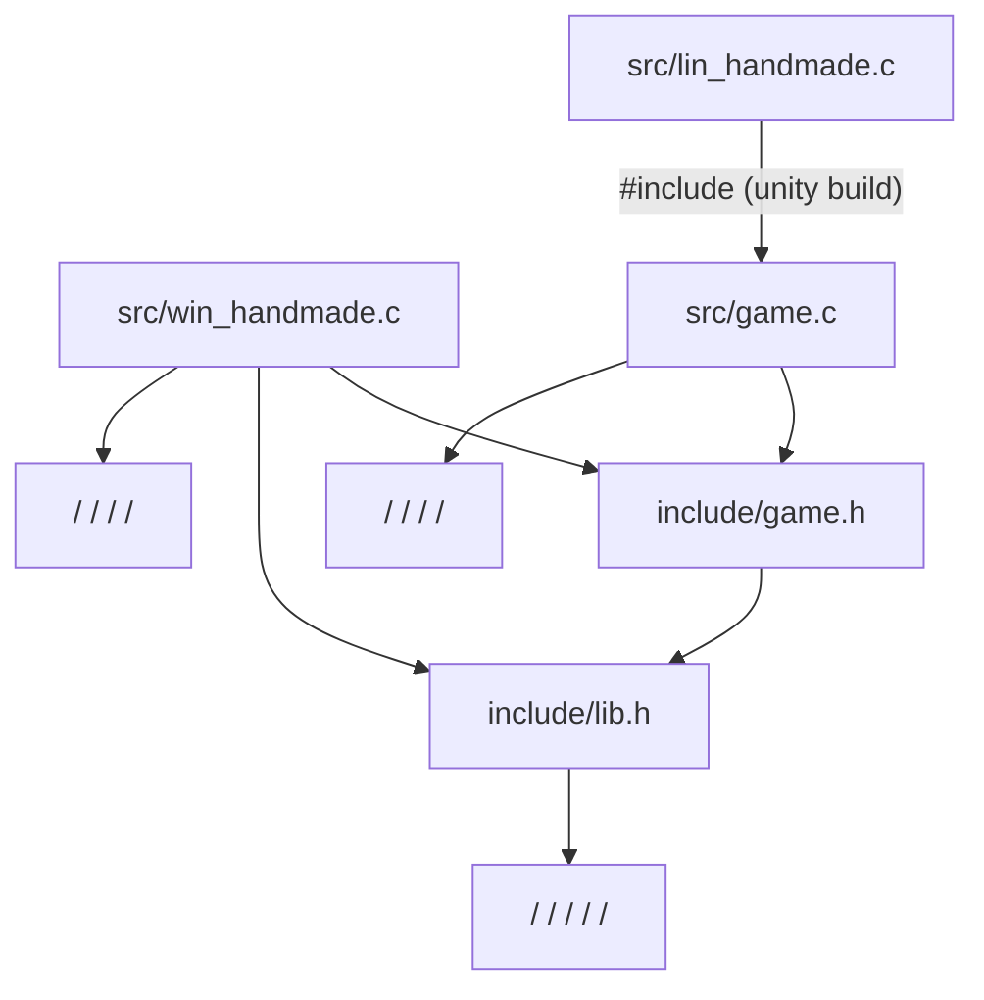

# Handmade hero

## Arch
Virtualising the game for the OS (platform)

- "->" means use

os -> platform <-> core

## Unity build

```mermaid
graph TD
    lin["src/lin_handmade.c"]
    win["src/win_handmade.c"]
    game_c["src/game.c"]
    game_h["include/game.h"]
    lib_h["include/lib.h"]

    win_sys["<windows.h> / <dsound.h> / <xinput.h> / <stdint.h> / <stdio.h>"]
    game_sys["<assert.h> / <limits.h> / <stddef.h> / <stdint.h> / <stdlib.h>"]
    lib_sys["<assert.h> / <math.h> / <stdint.h> / <stdio.h> / <time.h> / <intrin.h>"]

    lin -->|"#include (unity build)"| game_c
    game_c --> game_h
    game_c --> game_sys
    win --> game_h
    win --> lib_h
    win --> win_sys
    game_h --> lib_h
    lib_h --> lib_sys
```