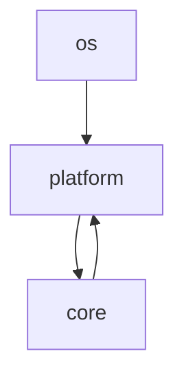
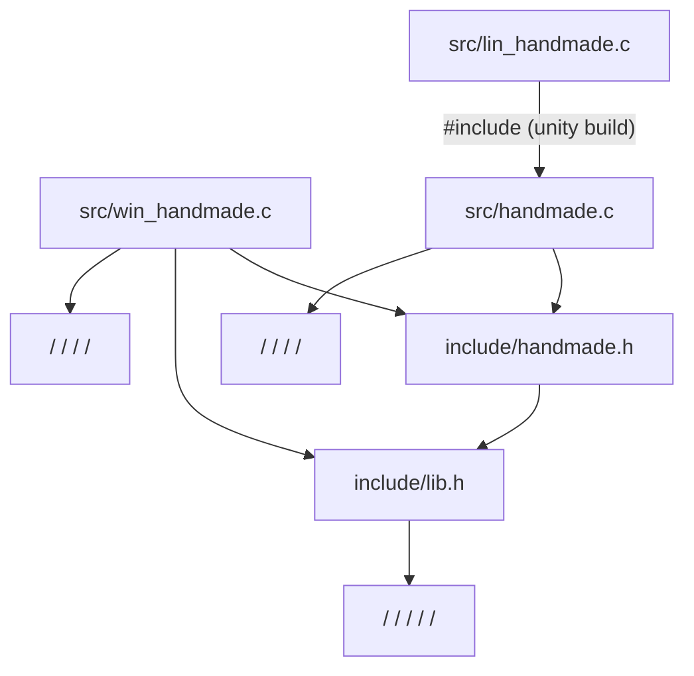

# Handmade hero

## Architecture
Virtualising the game for the OS (platform)

```mermaid
graph TD
    os --> platform
    platform --> core
    core --> platform
```

## Unity build

```mermaid
graph TD
    lin["src/lin_handmade.c"]
    win["src/win_handmade.c"]
    handmade_c["src/handmade.c"]
    handmade_h["include/handmade.h"]
    lib_h["include/lib.h"]

    win_sys["<windows.h> / <dsound.h> / <xinput.h> / <stdint.h> / <stdio.h>"]
    std_lib["<assert.h> / <limits.h> / <stddef.h> / <stdint.h> / <stdlib.h>"]
    lib_sys["<assert.h> / <math.h> / <stdint.h> / <stdio.h> / <time.h> / <intrin.h>"]

    lin -->|"#include (unity build)"| handmade_c
    handmade_c --> handmade_h
    handmade_c --> std_lib
    win --> handmade_h
    win --> lib_h
    win --> win_sys
    handmade_h --> lib_h
    lib_h --> lib_sys
```